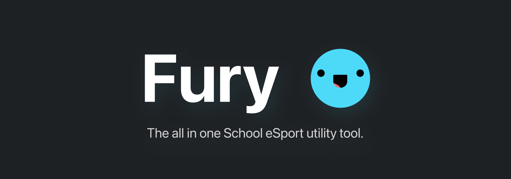

# Welcome to Fury

Fury, also dubbed Fury Bot, is an all-in-one moderation assistant for Discord eSports servers owned and operated by K-12 schools and higher education. Complete with team management features like practices, scrims, and activity tracking, as well as logging, moderation, and profanity detection, Fury is your solution to keeping a school-based community safe.

Originally built for the Florida State Virtual School (FLVS) Discord Server, Fury Bot has since been
expanded to support any other school and organization that needs a moderation assistant. Invite
Fury to your server today to get started.

## Features

### Team Management System

The team management system was the key focus of Fury. The goal was for administrators to be able to create unique, private chats for a given team on their eSports server. This allows team members a localized space to communicate, coordinate, and strategize.

To assist with this, Fury has many useful team management features, including:

- **Team Management**: Easily create and delete teams. A "team" is a private chat for a group of users.
- **Team Practices**: You want your players to be.. playing, right?! Allow your teams to keep track of their total time spent practicing.
- **Team Scrims**: Let's encourage some friendly competition! Allow your teams to independently schedule scrimmages with other teams on the server. Fury will manage the scheduling, reminders, and cleanup of these events.
- **Team Customization**: Give every team a unique nickname, logo, and description. Also, add custom chats and voice channels for each team if they need it.
- **Team Member Management**: Have **both** a main and sub-roster for each team. This allows for more flexibility in managing team members.
- **Team Captains**: Assign a team captain, or captains, to a team. Captains, who are often students, can look after their assigned teams and help manage them.

### Image Requests

Let's face it, kids love their memes. But, we all know that not all memes are appropriate. Fury has a built-in image request system that allows users to request images, or other attachments, to be sent in a channel. A request is sent off to the moderation team, who can approve or deny the request. If approved, the image is sent in the channel. If denied, the user is notified.

### Discord AutoMod Piggybacking

Fury has trackers built on top of the Discord AutoMod system. This allows Fury to track the number of infractions a user has. This is useful for moderators who want to easily identify repeat offenders.

### More is Always Coming

Fury is always being updated with new features and improvements. If you have a feature request, feel free to open a Discussion or Issue on the repository.

To see what's coming next, check out the [**Fury Development Board**](https://github.com/users/trevorflahardy/projects/12/views/1) for ongoing and upcoming features.

## Invite Fury to Your Server

Feel free to use [**this link**](https://discord.com/oauth2/authorize?client_id=808814834326044732&scope=bot+applications.commands) to invite Fury to your Discord server today.
